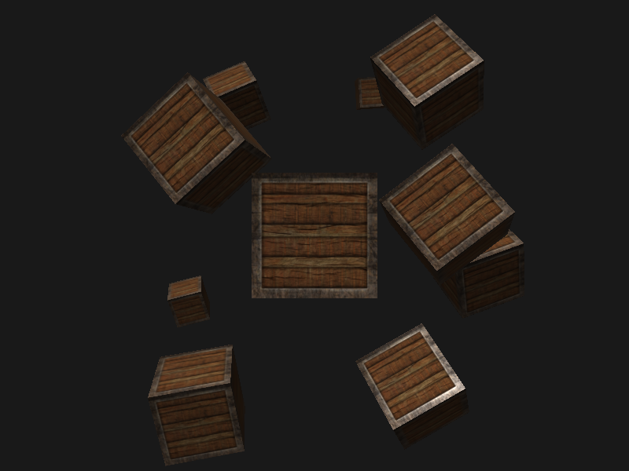

## 平行光

```c++
  // 定义是个不同的箱子位置
  glm::vec3 cubePositions[] = {
      glm::vec3(0.0f, 0.0f, 0.0f),
      glm::vec3(2.0f, 5.0f, -15.0f),
      glm::vec3(-1.5f, -2.2f, -2.5f),
      glm::vec3(-3.8f, -2.0f, -12.3f),
      glm::vec3(2.4f, -0.4f, -3.5f),
      glm::vec3(-1.7f, 3.0f, -7.5f),
      glm::vec3(1.3f, -2.0f, -2.5f),
      glm::vec3(1.5f, 2.0f, -2.5f),
      glm::vec3(1.5f, 0.2f, -1.5f),
      glm::vec3(-1.3f, 1.0f, -1.5f)
  };
```

**渲染循环**

```c++
glm::mat4 model = glm::mat4(1.0f);
for (unsigned int i = 0; i < 10; i++)
{
    model = glm::mat4(1.0f);
    model = glm::translate(model, cubePositions[i]);

    float angle = 10.0f * i;
    model = glm::rotate(model, glm::radians(angle), glm::vec3(1.0f, 0.3f, 0.5f));

    ourShader.setMat4("model", model);
    glBindVertexArray(boxGeometry.VAO);
    glDrawElements(GL_TRIANGLES, boxGeometry.indices.size(), GL_UNSIGNED_INT, 0);
}
```

**fragment shader**

```glsl
// 光源属性
struct Light {

    vec3 direction; // 定向光

    vec3 ambient;
    vec3 diffuse;
    vec3 specular;
};

// vec3 lightDir = normalize(lightPos - outFragPos);
vec3 lightDir = normalize(light.direction);

```

### 效果



## 参考

https://learnopengl-cn.github.io/02%20Lighting/05%20Light%20casters/#_7
